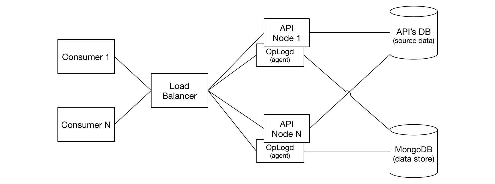
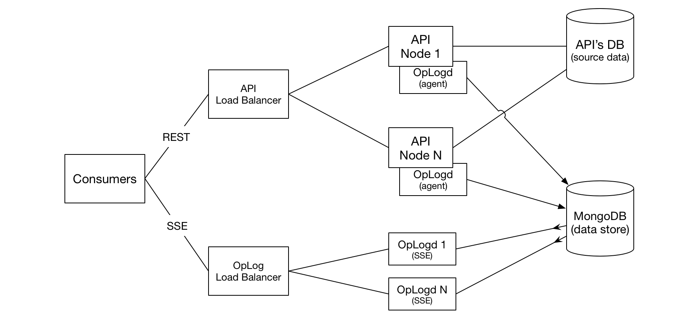

# REST Operation Log [](https://godoc.org/github.com/dailymotion/oplog) [](https://raw.githubusercontent.com/dailymotion/oplog/master/LICENSE) [](https://travis-ci.org/dailymotion/oplog)

OpLog is used as a real-time data synchronization layer between a producer (generally a REST API) and consumers. Basically, it's a generic database replication system for web APIs or an easy way to add a public streaming capability to an existing API.

Typical use cases:

* A component handles an authoritative database and several independent components need to keep locally an up-to-date read-only view of the data (e.g.: search engine indexing, recommendation engines, multi-regions architecture, etc.) or to react to certain changes (i.e.: spam detection, analytics, etc.).
* Implement a public streaming API to monitor changes to objects within the service's model. With the use of [Server Sent Event](http://dev.w3.org/html5/eventsource/) and filtering, it might be used directly from the browser to monitor changes that occur on objects displayed on the page (à la [Meteor](https://www.meteor.com)) or from a native mobile application to keep an up-to-date offline view of the data.

The agent may run locally on same nodes/containers as the API/application producing updates to the data model. The agent receives notifications of updates (operations) via UDP from the producer application and forwards them to the central oplog's data store (a MongoDb cluster). If the central data store is not available, operations are buffered in memory, waiting for the database cluster to be available again.


The agent also exposes a [Server Sent Event](http://dev.w3.org/html5/eventsource/) API for consumers to be notified in real time about model changes. Thanks to the SSE protocol, a consumer can recover a connection breakage without loosing any updates by using the `Last-Event-ID` HTTP header (see [Server Sent Event API] below).

A [full replication] is also supported for freshly spawned consumers that need to have a full view of the data.

Change operations are stored on a central MongoDB server. A [tailable cursor](http://docs.mongodb.org/manual/tutorial/create-tailable-cursor/) on a MongoDB [capped collection](http://docs.mongodb.org/manual/core/capped-collections) is used for real-time updates and final states of objects is maintained in a secondary collection for full replication support. The actual data is not stored in the OpLog's data store ; the monitored API continues to serve as the authoritative source of data and as the gatekeeper for it (authen/authz). Only modified object's `type` and `id` are stored together with the timestamp of the update and some related "parent" object references, useful for filtering. What you put in `type`, `id` and `parents` is up to the service, and must be meaningful to fetch the actual objects data from their API. An optional reference to the modified object can be provided by the OpLog API if the URL schema is setup (see [Starting the agent] below for more info).

As the it is highly expected that the OpLog may miss some operations from the API, a [Periodical Source Synchronization] mechanism is available

A typical deployment includes an oplogd agent running locally on every node of a cluster serving the API to monitor. The agent serves both roles: 1) ingesting operations coming from the API and 2) streaming aggregated operation of all agents to consumers. The same load balancer use to serve the API can expose the OpLog SSE endpoint:



Another deployment choice may be to separate the SSE API from the operations ingestion. This can be very easily done by running a separated cluster of oplogd daemons:



## Install

To install the project, execute the following commands:

    go get -u github.com/dailymotion/oplog
    go build -a -o /usr/local/bin/oplogd github.com/dailymotion/oplog/cmd/oplogd
    go build -a -o /usr/local/bin/oplog-sync github.com/dailymotion/oplog/cmd/oplog-sync
    go build -a -o /usr/local/bin/oplog-tail github.com/dailymotion/oplog/cmd/oplog-tail

## Starting the agent

To start the agent, run the following command:

    oplogd --mongo-url mongodb://[username:password@]host1[:port1][,host2[:port2],...[,hostN[:portN]]]/database[?options]

The `oplog_events` and `oplog_states` collections will be created in the specified database. It is advised to dedicate a database to this service in order to not to share locks contention with another services.

Available options:

* `--capped-collection-size=10485760`: Size of the created MongoDB capped collection size in bytes (default 10MB).
* `--debug=false`: Show debug log messages.
* `--listen=":8042"`: The address to listen on. Same address is used for both SSE(HTTP) and UDP APIs.
* `--max-queued-events=100000`: Number of events to queue before starting throwing up UDP messages.
* `--mongo-url`: MongoDB URL to connect to.
* `--object-url`: A URL template to reference objects. If this option is set, SSE events will have an "ref" field with the URL to the object. The URL should contain {{type}} and {{id}} variables (i.e.: http://api.mydomain.com/{{type}}/{{id}})
* `--password`: Password protecting the global SSE stream.

## UDP API

To send operations to the agent, a UDP datagram containing a JSON object must be crafted and sent on the agent's UDP port (8042 by default).

The format of the message is as follow:

```javascript
{
    "event": "insert",
    "parents": ["video/xk32jd", "user/xkjdi"],
    "type": "video",
    "id": "xk32jd",
}
```

The following keys are required:

* `event`: The type of event. Can be `insert`, `update` or `delete`.
* `parents`: The list of parent objects of the modified object. The advised format for items of this list is `type/id` but any format is acceptable. It is generally a good idea to put a reference to the modified object itself in this list in order to easily let the consumers filter on any updates performed on the object.
* `type`: The object type (i.e.: `video`, `user`, `playlist`, …)
* `id`: The object id of the impacted object as string.

The `timestamp` field is optional. It must contains the date when the object has been updated as RFC 3339 representation. If not provided, the time when the operation has been received by the agent is used instead.

See `examples/` directory for implementation examples in different languages.

## Server Sent Event API

The [SSE](http://dev.w3.org/html5/eventsource/) API runs on the same port as UDP API but using TCP. It means that agents have both input and output roles so it is easy to scale the service by putting an agent on every node of the source API cluster and expose their HTTP port via the same load balancer as the API while each node can send their updates to the UDP port on their localhost.

The W3C SSE protocol is respected by the book. To connect to the API, a GET on `/` with the `Accept: text/event-stream` header is performed. If no `Last-Event-ID` HTTP header is passed, the OpLog server will start sending all future operations with no backlog. On each received operation, the client must store the last associated "event id" as operations are treated. This event id will be used to resume the stream where it has been left in the case of a disconnect. The client just has to send the last consumed "event id" using the `Last-Event-ID` HTTP header.

It the case that the id defined by `Last-Event-ID` is no longer available in the underlying "oplog_events" capped collection, the agent will automatically fallback to replication by converting the oplog event id into a timestamp.

The following filters can be passed as a query-string:
* `types` A list of object types to filter on separated by comas (i.e.: `types=video,user`).
* `parents` A coma separated list of parents to filter on (i.e.: `parents=video/xk32jd,user/xkjdi`

```
GET / HTTP/1.1
Accept: text/event-stream

HTTP/1.1 200 OK
Content-Type: text/event-stream; charset=utf-8

id: 545b55c7f095528dd0f3863c
event: insert
data: {"timestamp":"2014-11-06T03:04:39.041-08:00","parents":["x3kd2"],"type":"video","id":"xekw","ref":"http://api.mydomain.com/video/xekw"}

id: 545b55c8f095528dd0f3863d
event: delete
data: {"timestamp":"2014-11-06T03:04:40.091-08:00","parents":["x3kd2"],"type":"video","id":"xekw","ref":"http://api.mydomain.com/video/xekw"}

…
```

## Full Replication

If required, a full replication with all (not deleted) objects can be performed before streaming live updates. To perform a full replication, pass `0` as value for the `Last-Event-ID` HTTP header. Numeric event ids with 13 digits or less are considered replication ids, which represent a milliseconds UNIX timestamp. By passing a millisecond timestamp, you are asking to replicate all objects that have been modified passed this date. Passing `0` thus ensures that every object will be replicated.

If a full replication is interrupted during the transfer, the same mechanism as for live updates is used. Once replication is complete, the stream will automatically switch to the live events stream so that the consumer does not miss any updates.

When a full replication starts, a special `reset` event with no data is sent to inform the consumer that it should reset its database before applying the subsequent operations.

Once the replication is complete and the OpLog switches back to the live updates, a special `live` event with no data is sent. This event can be useful for a consumer to know when it is safe for the consumer's service to be activated in production for instance.

## Periodical Source Synchronization

There is many ways for the OpLog to miss some updates and thus have an incorrect view of the current state of the source data. In order to cope with this issue, a regular synchronization process with the source data content can be performed. The sync is a separate process which compares a dump of the real data with what the OpLog has stored within its own database. For any discrepancies **which is anterior** to the dump in the OpLog's database, the sync process will generate an appropriate operation in the OpLog to fix the delta on both its own database and for all consumers.

The dump must be in a streamable JSON format. Each line is a JSON object with the same schema as of the `data` part of the SEE API response.
Dump example:

```javascript
{"timestamp":"2014-11-06T03:04:39.041-08:00", "parents": ["user/xl2d"], "type":"video", "id":"x34cd"}
{"timestamp":"2014-12-24T02:03:05.167+01:00", "parents": ["user/xkwek"], "type":"video", "id":"x12ab"}
{"timestamp":"2014-12-24T01:03:05.167Z", "parents": ["user/xkwek"], "type":"video", "id":"x54cd"}
…
```

The `timestamp` must represent the last modification date of the object as an RFC 3339 representation.

The `oplog-sync` command is used with this dump in order to perform the sync. This command will connect to the database, do the comparisons and generate the necessary oplog events to fix the deltas. This command does not need an `oplogd` agent to be running in order to perform its task.

Note that the `oplog-sync` command is the perfect tool to boostrap an OpLog with an existing API.

BE CAREFUL, any object absent of the dump having a timestamp lower than the most recent timestamp present in the dump will be deleted from the OpLog.

## Status Endpoint

The agent exposes a `/status` endpoint over HTTP to show some statistics about itself. A JSON object is returned with the following fields:

* `events_received`: Total number of events received on the UDP interface
* `events_sent`: Total number of events sent thru the SSE interface
* `events_ingested`: Total number of events ingested into MongoDB with success
* `events_error`: Total number of events received on the UDP interface with an invalid format
* `events_discarded`: Total number of events discarded because the queue was full
* `queue_size`: Current number of events in the ingestion queue
* `queue_max_size`:  Maximum number of events allowed in the ingestion queue before discarding events
* `clients`: Number of clients connected to the SSE API
* `connections`: Total number of connections established on the SSE API

```javascript
GET /status

HTTP/1.1 200 OK
Content-Length: 144
Content-Type: application/json
Date: Thu, 06 Nov 2014 10:40:25 GMT

{
    "clients": 0,
    "connections": 0,
    "events_discarded": 0,
    "events_error": 0,
    "events_ingested": 0,
    "events_received": 0,
    "events_sent": 0,
    "queue_max_size": 100000,
    "queue_size": 0,
    "status": "OK"
}
```

## Consumer

To write a consumer you may use any SSE library and consume the API yourself. If your consumer is written in Go, a dedicated consumer library is available (see [github.com/dailymotion/oplogc](http://godoc.org/github.com/dailymotion/oplogc)).

## Licenses

All source code is licensed under the [MIT License](LICENSE).
